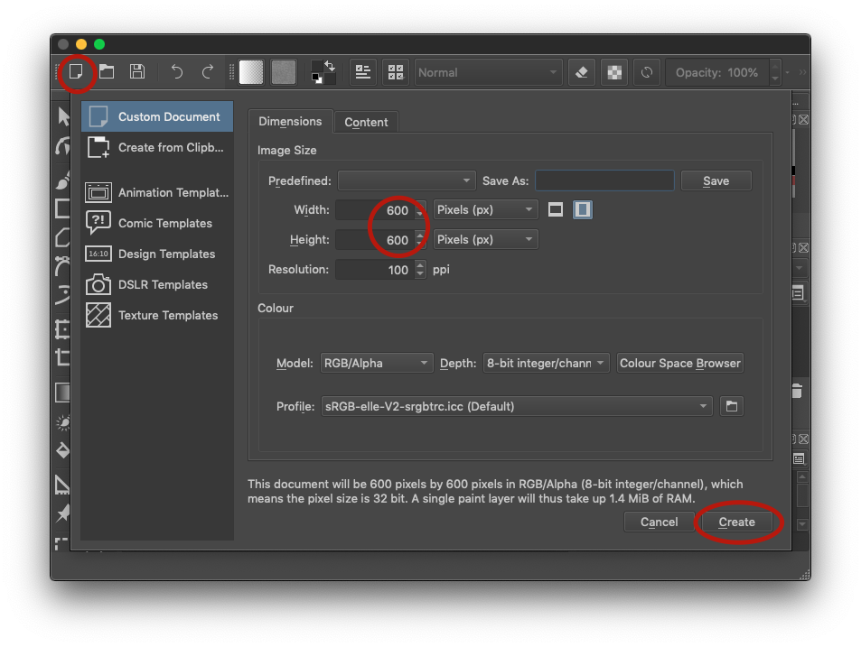

# Tutorial: Chase game

In this chapter we will build a complete chase game together, step by step.  The Python we will use is very simple: just conditionals and loops.

The techniques here should be familiar to you because we used them in Program~\ref{code:background}, \ref{code:keyboard_input}, \ref{code:collisions} and \ref{code:chase}

Now we will show you how to put them all together in one program.

\newpage

## Moving Actor over a background

We must create two image files for our game.  You can use a program such as Krita[^krita_footnote] to draw them and save them in the `images` folder (accessible with the
`images` button in Mu).  One is the player, called `player.png`.  It should be small, about 64×64 pixels.  Ideally it should have a transparent background.

[^krita_footnote]: https://krita.org

The other is the background for the game itself.  It can look like whatever you want, but it must be the same size as the game window, which will be 600×600 pixels.



\begin{codelisting}
\codecaption{Chase game}
\label{code:chase1}
<<(programs/chase1.py)
\end{codelisting}

\begin{aside}
\label{}
\heading{}
\noindent Run the program and move the Actor around with the keys.
\end{aside}

## Screen wrap-around

One problem you will soon find with the program is that you can move off the edge of the screen and get lost.  One way to solve this would be
to stop movement at the screen edges.  Instead we going to make the player teleport to the opposite edge when he leaves the screen.  Add this code
to the end of the program, and make sure it is indented so that it becomes part of the `update()` function.

```python
    if player.x > WIDTH:
        player.x = 0
    if player.x < 0:
        player.x = WIDTH
    if player.y < 0:
        player.y = HEIGHT
    if player.y > HEIGHT:
        player.y = 0
```

\begin{aside}
\label{}
\heading{}
\noindent Change the code so that the player stops at the edges rather than wraps-around.
\end{aside}

## Enemy chases the player

Let's add an enemy to chase the player.  At the top of the program, create a variable to store the enemy Actor:
```python
enemy = Actor("alien")
```

At the end of the `draw()` function (but still indented so part of the function), draw the enemy.  Remember there is only ever one single `draw()` function.  No
program has two.  All drawing goes inside this function.

Here is the complete function including the new line at the end:

```python
def draw():
    screen.clear()
    background.draw()
    player.draw()
    enemy.draw()
```


At the end of the `update()` function (but still indented so part of the function), add these lines to move the enemy:

```python
    if enemy.x < player.x:
        enemy.x = enemy.x + 1
    if enemy.x > player.x:
        enemy.x = enemy.x - 1
    if enemy.y < player.y:
        enemy.y = enemy.y + 1
    if enemy.y > player.y:
        enemy.y = enemy.y - 1
    if player.colliderect(enemy):
        exit()
```

\begin{aside}
\label{}
\heading{}
\noindent Run the program verify the enemy chases the player.
\end{aside}

\begin{aside}
\label{}
\heading{}
\noindent Make the enemy faster so the game is more difficult.
\end{aside}

\begin{aside}
\label{}
\heading{}
\noindent Create an image file `enemy.png` and save it in the `images` folder.  Change the code so it loads `"enemy"` instead of `"alien"`.
\end{aside}


## Collecting items

Create a small image file `coin.png` and save it in the `images` folder. It should look like a coin or something else you would like to collect.  We will also need a variable to store the *score*, i.e. number of coins collected.

```python
coin = Actor("coin", pos=(300,300))
score = 0
```

At the end of the `draw()` function (but still indented so part of the function), draw the coin.  Remember there is only ever one single `draw()` function.  No
program has two.  All drawing goes inside this function.

Here is the complete function including the new line at the end:

```python
def draw():
    screen.clear()
    background.draw()
    player.draw()
    enemy.draw()
    coin.draw()
```

At the end of the `update()` function (but still indented so part of the function), add these lines to move the coin when it is collected:

```python
    if coin.colliderect(player):
        coin.x = random.randint(0, WIDTH)
        coin.y = random.randint(0, HEIGHT)
        score = score + 1
        print("Score:", score)
```

\begin{aside}
\label{}
\heading{}
\noindent Run the program and collect a coin.  What happens?
\end{aside}

```
NameError: name 'random' is not defined
```

This happens because we are using a function `randint()` to get a random number.  This function is not build-in to Python; it is part of the *random* library.  So at the top of the program, add the first line:

```python
import random
```

\begin{aside}
\label{}
\heading{}
\noindent Run the program again and collect a coin.  Does it work now?
\end{aside}

No!

```
UnboundLocalError: local variable 'score' referenced before assignment
```

You will get an error because `score` is a global variable and we are trying to modify it inside the `update()` function.  Therefore at the **top** of the `update()` function, add this line to declare to Python
our intention to modify a global variable:

```python
global score
```

It must be the **first** line in the function and it must be **indented**.  The lines surrounding it should look like this:

```python
def update():
    global score
    if keyboard.right:
```

\begin{aside}
\label{}
\heading{}
\noindent Run the program again and verify it works!
\end{aside}

## Player 2

We can make any game into a two player game.  At the top of the program, create a variable to store the Actor for the second player:
```python
player2 = Actor("alien")
```

At the end of the `draw()` function (but still indented so part of the function), draw the enemy.  Here is the complete function with the new line at the end:

```python
def draw():
    screen.clear()
    background.draw()
    player.draw()
    enemy.draw()
    coin.draw()
    player2.draw()
```

At the end of the `update()` function (but still indented so part of the function), add these lines to move the second player:

```python
    if keyboard.d:
        player2.x = player2.x + 4
    if keyboard.a:
        player2.x = player2.x - 4
    if keyboard.s:
        player2.y = player2.y + 4
    if keyboard.w:
        player2.y = player2.y - 4
    if player.colliderect(player2):
        exit()
```

\begin{aside}
\label{}
\heading{Advanced}
\noindent Create a variable `score2` and store the score for player two, i.e. it goes up when he collides with a coin.
\end{aside}

## Showing the score on the screen

At the end of the `draw()` function (but still indented so part of the function), draw a title on the screen:

```python
    screen.draw.text("My game", (200,0), color='red')
```

The `draw.text()` function is not like `print()` - it can only print strings of text, not numbers.  Therefore we must convert
the score into a string.  Add these lines to the end of the `draw()` function:
```python
    score_string = str(score)
    screen.draw.text(score_string, (0,0), color='green')
```

\begin{aside}
\label{}
\heading{}
\noindent Change the colour of the text.
\end{aside}

\begin{aside}
\label{}
\heading{Advanced}
\noindent Display the word "Score: " before the score.
\end{aside}
  

\begin{aside}
\label{}
\heading{Advanced}
\noindent When the `score` reaches 10, show a message on the screen to congratulate the player
\end{aside}

## Timer

Add a variable at the top of the program (but prerably after any `import` statements) to store the number of seconds
of time remaining in the game:

```python
time = 20
```

Pygame Zero calls our `update()` function many times per second.  We can ask it to tell us how much time has passed
by adding a *parameter* to the function, `delta`.  We then subtract this from the remaining time.  Modify `update()` so
the first lines look like this:

```python
def update(delta):
    global score, time
    time = time - delta
    if time <= 0:
         exit()
```

We can also display the time on the screen.  At the end of the `draw()` function (but still indented so part of the function) add these lines:

```python
    time_string = str(time)
    screen.draw.text(time_string, (50,0), color='green')

```

\begin{aside}
\label{}
\heading{}
\noindent Run the program.  Could the displayed time be improved?
\end{aside}

We dont need to see the decimal places in the time.  Modify those lines to use the `round()` function, like this:

```python
    time_string = str(round(time))
    screen.draw.text(time_string, (50,0), color='green')

```

## Finished game

Here is the finished game with all the changes included:

\begin{codelisting}
\codecaption{Finished chase game}
\label{code:chaser7}
<<(programs/chaser7.py)
\end{codelisting}

However that is not the end!  There are many things you could add to this game.

* Add more enemies.
* Give the player three lives.